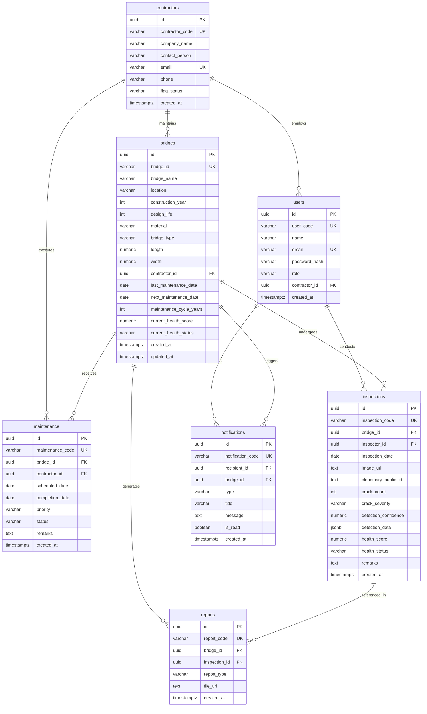
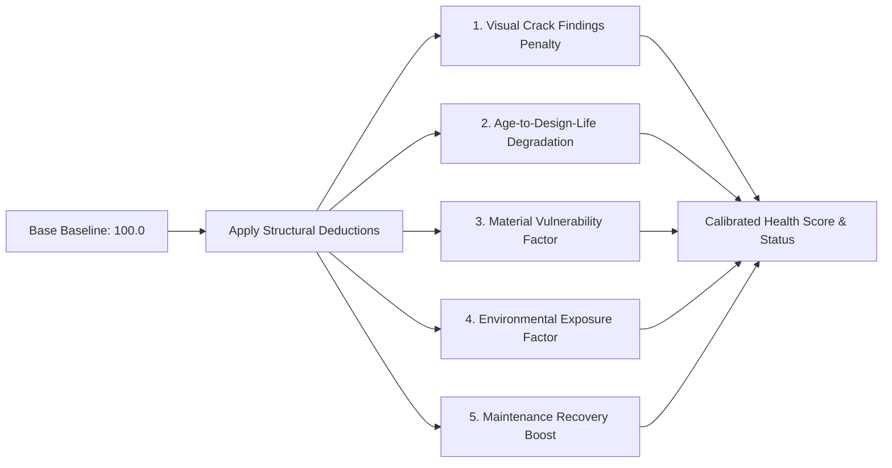
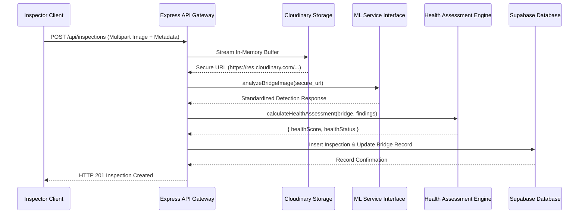

# SetuSight: Smart Bridge Health Monitoring and Asset Management System
## Exhaustive Engineering Architecture & Technical System Documentation

---

### Executive Summary

| Document Metadata | Specification |
| :--- | :--- |
| **Project Title** | Smart Bridge Health Monitoring and Asset Management System using Computer Vision |
| **Product Name** | **SetuSight** |
| **Target Infrastructure** | Regional and National Bridge Asset Networks (Navi Mumbai Infrastructure Demo) |
| **Document Version** | 2.0.0 (Production Release) |
| **Architecture Paradigm** | Pure Cloud Relational (Supabase PostgreSQL) + Cloud Asset Storage (Cloudinary) + Express.js REST API |
| **Security Standard** | Cryptographic Role-Based Access Control (RBAC) via JSON Web Tokens (JWT) & bcrypt |
| **Computer Vision Module** | YOLOv8 Visual Defect Detection Interface (Isolated Architectural Contract) |

---

## 1. System Architecture & High-Level Design

```mermaid
graph TD
    subgraph Client Layer
        LP[Public Landing Page /]
        AuthUI[Login Portal /login]
        AdminUI[Executive Admin Console /admin]
        InspectorUI[Field Inspector Portal /inspector]
        ContractorUI[Contractor Partner Portal /contractor]
        DossierUI[Bridge Asset Dossier & Timeline /bridge-details]
        ReportUI[Printable Structural Dossier /report-view]
    end

    subgraph Application & Gateway Layer
        Router[Express.js REST API Gateway]
        AuthMW[JWT Verification & Role Guard Middleware]
        UploadMW[Multer In-Memory Buffer Streamer]
        ErrorMW[Centralized Fail-Safe Error Handler]
    end

    subgraph Service & Engine Layer
        DBService[Supabase Direct Query Service]
        MLService[Computer Vision Interface: YOLOv8 Placeholder]
        HealthEngine[Multi-Parameter Structural Health Engine]
        NotifService[Database-Backed Alert Dispatcher]
    end

    subgraph Cloud Infrastructure Layer
        Supabase[(Supabase PostgreSQL Database)]
        Cloudinary[(Cloudinary Cloud Media Storage)]
    end

    Client Layer -->|HTTP / HTTPS Requests| Router
    Router --> AuthMW
    Router --> UploadMW
    AuthMW --> DBService
    UploadMW -->|In-Memory Buffer Stream| Cloudinary
    Cloudinary -->|Secure HTTPS URL & Public ID| DBService
    DBService --> Supabase
    Router --> MLService
    Router --> HealthEngine
    HealthEngine --> DBService
    Router --> NotifService
    NotifService --> DBService
    Router --> ErrorMW
```

### 1.1 Architectural Guarantees & Single Source of Truth
1. **Zero Local Fallback Policy:** The application communicates directly with Supabase PostgreSQL and Cloudinary. There is **no** local JSON database, SQLite database, filesystem persistence, or in-memory fallback.
2. **Deterministic Failure Modes:**
   - When Supabase is unreachable or unconfigured, the API halts cleanly and returns:
     ```json
     { "success": false, "error": "Database service unavailable" }
     ```
     with `HTTP 503 Service Unavailable`.
   - When Cloudinary is unreachable or unconfigured during image upload, the API returns:
     ```json
     { "success": false, "error": "Image upload service unavailable" }
     ```
     with `HTTP 503 Service Unavailable`.
3. **Stateless Memory Buffer Streaming:** File uploads never write temporary files to local disk. Uploads are buffered in memory via `multer.memoryStorage({ limits: { fileSize: 10 * 1024 * 1024 } })` and streamed directly to Cloudinary over HTTPS.

---

## 2. Database Architecture & Schema Specifications

The database schema is defined in [schema.sql](file:///Users/yunuskhan/Desktop/SetuSIght/schema.sql) and executed directly on Supabase PostgreSQL.



### 2.1 Table Data Dictionaries

#### 1. `contractors`
| Column | Type | Constraints | Description |
| :--- | :--- | :--- | :--- |
| `id` | `UUID` | `PRIMARY KEY, DEFAULT gen_random_uuid()` | Unique immutable contractor identifier |
| `contractor_code` | `VARCHAR(20)` | `UNIQUE NOT NULL` | Display identifier (e.g. `C001`, `C002`) |
| `company_name` | `VARCHAR(255)` | `NOT NULL` | Registered engineering firm name |
| `contact_person` | `VARCHAR(255)` | `NOT NULL` | Authorized executive representative |
| `email` | `VARCHAR(255)` | `UNIQUE NOT NULL` | Login & notification email address |
| `phone` | `VARCHAR(50)` | `NOT NULL` | Emergency and operational dispatch phone |
| `flag_status` | `VARCHAR(50)` | `CHECK IN ('Normal', 'Yellow / Review', 'Red / Escalated Review')` | Contractor performance & compliance audit badge |
| `created_at` | `TIMESTAMPTZ` | `DEFAULT now()` | Record creation timestamp |

#### 2. `users`
| Column | Type | Constraints | Description |
| :--- | :--- | :--- | :--- |
| `id` | `UUID` | `PRIMARY KEY, DEFAULT gen_random_uuid()` | Unique user identifier |
| `user_code` | `VARCHAR(20)` | `UNIQUE NOT NULL` | Unique user badge code (e.g. `A001`, `I001`) |
| `name` | `VARCHAR(255)` | `NOT NULL` | Full legal name and designation |
| `email` | `VARCHAR(255)` | `UNIQUE NOT NULL` | Unique authentication email |
| `password_hash` | `VARCHAR(255)` | `NOT NULL` | 10-round salted bcrypt hash |
| `role` | `VARCHAR(50)` | `CHECK IN ('admin', 'inspector', 'contractor')` | System RBAC authorization role |
| `contractor_id` | `UUID` | `REFERENCES contractors(id) ON DELETE SET NULL` | Linked contractor firm (for contractor users) |
| `created_at` | `TIMESTAMPTZ` | `DEFAULT now()` | Account creation timestamp |

#### 3. `bridges`
| Column | Type | Constraints | Description |
| :--- | :--- | :--- | :--- |
| `id` | `UUID` | `PRIMARY KEY, DEFAULT gen_random_uuid()` | Internal database UUID |
| `bridge_id` | `VARCHAR(50)` | `UNIQUE NOT NULL` | Public structure code (e.g. `BR001`, `BR003`) |
| `bridge_name` | `VARCHAR(255)` | `NOT NULL` | Official civil engineering asset name |
| `location` | `VARCHAR(255)` | `NOT NULL` | Node/Municipality (e.g. `Nerul`, `Seawoods`) |
| `construction_year`| `INTEGER` | `NOT NULL` | Year bridge was commissioned |
| `design_life` | `INTEGER` | `NOT NULL, DEFAULT 50` | Expected operational lifespan in years |
| `material` | `VARCHAR(100)`| `NOT NULL` | Primary material (e.g. `Prestressed Concrete`) |
| `bridge_type` | `VARCHAR(100)`| `NOT NULL` | Engineering classification (e.g. `ROB`, `Flyover`) |
| `length` | `NUMERIC(10,2)`| `NOT NULL` | Total bridge span length in meters |
| `width` | `NUMERIC(10,2)`| `NOT NULL` | Deck carriageway width in meters |
| `contractor_id` | `UUID` | `REFERENCES contractors(id) ON DELETE SET NULL` | Assigned maintenance contractor |
| `last_maintenance_date`| `DATE` | `NOT NULL` | Date of last executed structural repair |
| `next_maintenance_date`| `DATE` | `NOT NULL` | Scheduled next maintenance date |
| `maintenance_cycle_years`| `INTEGER`| `DEFAULT 5` | Routine overhaul recurrence cycle |
| `current_health_score` | `NUMERIC(5,2)`| `CHECK (0 <= score <= 100)` | Computed health index (0 - 100) |
| `current_health_status`| `VARCHAR(50)`| `CHECK IN ('Good', 'Moderate', 'Attention Required')` | Health categorization |
| `created_at` / `updated_at` | `TIMESTAMPTZ` | `DEFAULT now()` | Audit timestamps (auto-updated by trigger) |

---

## 3. Structural Health Assessment Engine (Mathematical Model)

The Health Assessment Engine ([src/services/healthService.js](file:///Users/yunuskhan/Desktop/SetuSIght/src/services/healthService.js)) computes deterministic structural health scores ($S \in [0, 100]$).



### 3.1 Mathematical Formulations

$$\text{Health Score } (S) = \operatorname{clamp}\Big(100.0 - (D_{\text{crack}} + D_{\text{age}} + D_{\text{env}}) + B_{\text{maint}},\, 5.0,\, 100.0\Big)$$

#### 1. Crack Impact Deduction ($D_{\text{crack}}$)
$$D_{\text{crack}} = P_{\text{severity}} + (\min(N_{\text{cracks}}, 15) \times 1.8)$$
Where $P_{\text{severity}}$ is determined by structural inspection findings:
- `none`: $0.0$
- `low`: $6.0$
- `moderate`: $16.0$
- `high`: $28.0$
- `critical`: $38.0$

#### 2. Age-to-Design-Life Penalty ($D_{\text{age}}$)
$$\text{Age Ratio } (R) = \frac{\max(0, \text{Current Year} - \text{Construction Year})}{\text{Design Life}}$$
$$D_{\text{age}} = \begin{cases}
R \times 12.0 & \text{if } R \le 0.5 \\
6.0 + (R - 0.5) \times 22.0 & \text{if } 0.5 < R \le 1.0 \\
17.0 + (R - 1.0) \times 32.0 & \text{if } R > 1.0 \text{ (Overaged Structure)}
\end{cases}$$

#### 3. Material & Environmental Exposure Multiplier ($D_{\text{env}}$)
$$D_{\text{env}} = M_{\text{material}} + E_{\text{location}}$$
- **Material Factor ($M_{\text{material}}$):**
  - `Structural Steel`: $+3.5$ (Susceptible to corrosion in coastal environments)
  - `Reinforced Concrete`: $+2.0$ (Susceptible to spalling and carbonation)
  - `Prestressed Concrete`: $+0.5$ (High-integrity baseline)
  - `Composite`: $+1.5$
- **Environmental Exposure ($E_{\text{location}}$):**
  - Coastal / Creek / Marine (`Creek`, `Creek Bridge`): $+4.0$ (High salinity)
  - Heavy Traffic Corridor (`Flyover`, `ROB`, `Palm Beach`): $+2.5$ (Dynamic cyclic load)
  - Standard Urban Road: $+1.0$

#### 4. Maintenance Offset Boost ($B_{\text{maint}}$)
For each completed maintenance work order within the last 3 years:
$$B_{\text{maint}} = \min\Big(\sum \text{Boost}_{\text{completed}},\, 15.0\Big)$$

### 3.2 Categorical Health Status Mapping
$$\text{Health Status} = \begin{cases}
\mathbf{Good} & \text{if } S \ge 80.0 \\
\mathbf{Moderate} & \text{if } 60.0 \le S < 80.0 \\
\mathbf{Attention\ Required} & \text{if } S < 60.0
\end{cases}$$

---

## 4. Computer Vision (YOLOv8) Service Interface

The machine learning module is strictly isolated in [src/services/mlService.js](file:///Users/yunuskhan/Desktop/SetuSIght/src/services/mlService.js) to guarantee clean separation between infrastructure services and future ML model deployment.



### 4.1 ML Interface Output Contract
```typescript
interface MLAnalysisResult {
  isMock: boolean;             // true during placeholder phase
  status: string;             // "AI analysis module pending integration"
  crackDetected: boolean;     // Detected visual crack presence
  crackCount: number;         // Count of detected bounding boxes
  confidence: number;         // Mean confidence score [0.0 - 1.0]
  detections: Array<{
    bbox: [number, number, number, number]; // [x_min, y_min, x_max, y_max]
    confidence: number;
    label: string;            // e.g. "longitudinal_crack", "shear_crack"
    severity_level: "low" | "moderate" | "high" | "critical";
  }>;
  processedAt: string;        // ISO 8601 Timestamp
}
```

---

## 5. Security Architecture & Role-Based Access Control (RBAC)

### 5.1 Role Matrix & Capabilities

| Capability / Resource | Executive Admin (`admin`) | Field Inspector (`inspector`) | Contractor Partner (`contractor`) | Public Visitor |
| :--- | :---: | :---: | :---: | :---: |
| **View Public Bridge Network Table** | ✅ | ✅ | ✅ | ✅ |
| **View Executive Dashboard & Analytics** | ✅ | ❌ | ❌ | ❌ |
| **Register & Edit Bridge Inventory** | ✅ | ❌ | ❌ | ❌ |
| **Submit New Field Inspection & Photo** | ❌ | ✅ | ❌ | ❌ |
| **View Full Inspection History** | ✅ | ✅ | ❌ | ❌ |
| **Schedule Maintenance Work Order** | ✅ | ❌ | ❌ | ❌ |
| **View Assigned Maintenance Tasks** | ✅ | ❌ | ✅ *(Assigned Only)* | ❌ |
| **Update Work Order Status & Notes** | ✅ | ❌ | ✅ *(Assigned Only)* | ❌ |
| **View Bridge Dossier & Full History** | ✅ | ✅ | ❌ | ❌ |
| **Generate & Export Printable Reports** | ✅ | ✅ | ❌ | ❌ |
| **Audit Contractor Compliance Flags** | ✅ | ❌ | ❌ | ❌ |

### 5.2 Contractor Backend Isolation
Contractors are strictly restricted at the database query layer.
1. The authenticated contractor's `contractor_id` is encoded inside their JWT session token.
2. When calling `GET /api/bridges`, the backend injects `.eq('contractor_id', req.user.contractor_id)`.
3. When calling `GET /api/bridges/:id` or `PUT /api/maintenance/:id`, the controller validates:
   ```javascript
   if (req.user.role === 'contractor' && record.contractor_id !== req.user.contractor_id) {
     return res.status(403).json({
       success: false,
       error: "Access denied. Record not assigned to your contractor account."
     });
   }
   ```

---

## 6. Complete REST API Specifications

### 6.1 Authentication Endpoints

#### `POST /api/auth/login`
- **Description:** Authenticates credentials and returns a signed 7-day JWT token.
- **Request Body:**
  ```json
  {
    "email": "contractor@setusight.gov.in",
    "password": "contract123"
  }
  ```
- **Response (`200 OK`):**
  ```json
  {
    "success": true,
    "message": "Authentication successful",
    "token": "eyJhbGciOiJIUzI1NiIsInR5cCI6IkpXVCJ9...",
    "user": {
      "id": "c0000000-0000-0000-0000-000000000003",
      "name": "M/s InfraTech Projects Lead",
      "email": "contractor@setusight.gov.in",
      "role": "contractor",
      "contractor_id": "c1111111-1111-1111-1111-111111111111"
    }
  }
  ```

#### `GET /api/auth/me`
- **Headers:** `Authorization: Bearer <token>`
- **Response (`200 OK`):** Returns authenticated user session payload.

---

### 6.2 Bridge Inventory Endpoints

#### `GET /api/bridges`
- **Access:** Public / Filtered for `contractor` role.
- **Query Parameters:** `status`, `location`, `material`, `search`.
- **Behavior:** Returns all bridges for admin/public; returns **only** assigned bridges for logged-in contractors (`BR001`, `BR003`, `BR008`).
- **Response (`200 OK`):**
  ```json
  {
    "success": true,
    "count": 3,
    "data": [
      {
        "id": "d0000001-0000-0000-0000-000000000001",
        "bridge_id": "BR001",
        "bridge_name": "Nerul Railway Over Bridge",
        "location": "Nerul",
        "construction_year": 2012,
        "design_life": 50,
        "material": "Prestressed Concrete",
        "bridge_type": "Railway Over Bridge",
        "length": 420.00,
        "width": 18.50,
        "current_health_score": 88.50,
        "current_health_status": "Good",
        "maintenance_priority": "Low",
        "maintenance_status": "Completed"
      }
    ]
  }
  ```

#### `GET /api/bridges/:id`
- **Access:** Admin, Inspector, or Assigned Contractor.
- **Response (`200 OK`):** Detailed bridge specifications, inspection count, maintenance count, and latest inspection summary.

#### `POST /api/bridges` *(Admin Only)*
- **Headers:** `Authorization: Bearer <token>`
- **Request Body:**
  ```json
  {
    "bridge_id": "BR016",
    "bridge_name": "Kharghar Creek Flyover",
    "location": "Kharghar",
    "construction_year": 2020,
    "design_life": 60,
    "material": "Prestressed Concrete",
    "bridge_type": "Elevated Viaduct",
    "length": 520.00,
    "width": 24.00,
    "contractor_id": "c1111111-1111-1111-1111-111111111111"
  }
  ```
- **Response (`201 Created`):** Returns newly registered bridge asset with initial computed health index.

---

### 6.3 Field Inspection & Upload Endpoints

#### `POST /api/inspections` *(Inspector Only)*
- **Headers:** `Authorization: Bearer <token>`, `Content-Type: multipart/form-data`
- **Form Data Fields:**
  - `bridge_id`: Target bridge UUID
  - `inspection_date`: YYYY-MM-DD
  - `crack_severity`: `none` | `low` | `moderate` | `high` | `critical`
  - `crack_count`: Integer count
  - `remarks`: Field engineering remarks
  - `image`: Binary image file (JPEG, PNG, WebP $\le 10$MB)
- **Response (`201 Created`):**
  ```json
  {
    "success": true,
    "message": "Inspection uploaded and health assessment recorded successfully",
    "data": {
      "id": "e0000005-0000-0000-0000-000000000005",
      "bridge_id": "d0000001-0000-0000-0000-000000000001",
      "image_url": "https://res.cloudinary.com/c3wesoc5/image/upload/v1787335079/setusight/inspections/...",
      "health_score": 86.00,
      "health_status": "Good",
      "ml_analysis": {
        "isMock": true,
        "status": "AI analysis module pending integration"
      }
    }
  }
  ```

---

### 6.4 Maintenance Work Order Endpoints

#### `GET /api/maintenance`
- **Access:** Admin (all work orders) / Contractor (strictly assigned work orders).
- **Response (`200 OK`):** List of maintenance orders with bridge and contractor metadata.

#### `PUT /api/maintenance/:id`
- **Access:** Admin or Assigned Contractor.
- **Request Body:**
  ```json
  {
    "status": "Completed",
    "completion_date": "2026-08-21",
    "remarks": "Epoxy injection on pier P4 completed. Expansion joint seals replaced."
  }
  ```
- **Response (`200 OK`):** Updated maintenance record; triggers bridge health recalibration.

---

## 7. Frontend Portals & User Interface Architecture

```
public/
├── index.html            # Public Landing Page (Exact Design Tokens Preserved)
├── landing.css           # Design Tokens: Navy #10233D, Green #1F7A4D, Fonts
├── landing.js            # Live Bridge Network dynamic API loader
├── app.css               # Clean Engineering Dashboard Design System
├── app.js                # Core Application Framework (Auth, Notifications, Toasts)
├── login.html & .js      # Role-Based Login Portal with 1-Click Demo Fillers
├── admin.html & .js      # Executive Admin Console (Overview, CRUD, Maintenance, Analytics)
├── inspector.html & .js  # Field Inspector Portal (Photo Upload, Health Recalibration)
├── contractor.html & .js # Contractor Portal (Assigned Tasks, Bridges, Completed Repairs)
├── bridge-details.html   # Bridge Asset Dossier & Chronological Lifecycle Timeline
└── report-view.html      # Printable Official Structural Health Dossier
```

### 7.1 Design Tokens Reference

```css
:root {
  /* Primary Brand Colors */
  --navy: #10233D;
  --navy-dark: #0A1728;
  --navy-soft: #2C4263;
  --navy-faint: #637794;
  --green: #1F7A4D;
  --green-dark: #145C39;
  --green-tint: #E7F2EA;

  /* Status Indicators */
  --amber: #B07A12;
  --amber-tint: #FDF3DF;
  --red: #B5432E;
  --red-tint: #FBEAE7;
  --blue: #2C5F8A;

  /* Surfaces & Borders */
  --bg: #FAFAF8;
  --bg-card: #FFFFFF;
  --bg-alt: #F2F5F1;
  --border: #E2E6E1;
  --border-strong: #CBD3CA;

  /* Typography */
  --font-heading: 'Manrope', -apple-system, sans-serif;
  --font-body: 'Inter', -apple-system, sans-serif;
  --font-mono: 'IBM Plex Mono', monospace;
}
```

---

## 8. Deployment, Cloud Setup & Operations

### 8.1 Prerequisites
- Node.js $\ge 18.0.0$
- Supabase Project (PostgreSQL 15+)
- Cloudinary Account

### 8.2 Environment Configuration ([`.env`](file:///Users/yunuskhan/Desktop/SetuSIght/.env))
```ini
PORT=3000
NODE_ENV=development
JWT_SECRET=setusight_jwt_secret_key_2026_infrastructure_secure_token

# Supabase PostgreSQL Credentials
SUPABASE_URL=https://your-project-id.supabase.co
SUPABASE_KEY=eyJhbGciOiJIUzI1NiIsInR5cCI6IkpXVCJ9...

# Cloudinary Image Storage Credentials
CLOUDINARY_CLOUD_NAME=your-cloud-name
CLOUDINARY_API_KEY=your-api-key
CLOUDINARY_API_SECRET=your-api-secret
```

### 8.3 Database Setup Steps
1. Navigate to **Supabase Dashboard $\rightarrow$ SQL Editor**.
2. Run the DDL script in [`schema.sql`](file:///Users/yunuskhan/Desktop/SetuSIght/schema.sql) to create tables, indexes, and triggers.
3. Run the initial data seed script in [`seed.sql`](file:///Users/yunuskhan/Desktop/SetuSIght/seed.sql) or execute:
   ```bash
   npm run seed
   ```

### 8.4 Starting the Server
```bash
npm start
# SetuSight running on http://localhost:3000
```

---

## 9. Verification & Audit Test Suite

Automated verification tests are included in the repository:

1. **Service & Engine Test Suite:**
   ```bash
   node scripts/test-services.js
   ```
   - ✅ Verifies isolated ML YOLOv8 placeholder contract (`isMock: true`, `"AI analysis module pending integration"`).
   - ✅ Verifies mathematical rule-based health assessment across young, moderate, and critical bridges.
   - ✅ Verifies RBAC middleware.

2. **Contractor Portal & Access Control Test Suite:**
   ```bash
   node scripts/test-contractor-flow.js
   ```
   - ✅ Verifies contractor token includes `contractor_id`.
   - ✅ Verifies backend query isolation returns only `BR001`, `BR003`, `BR008`.
   - ✅ Verifies cross-contractor access rejection (`HTTP 403 Forbidden`).
   - ✅ Verifies maintenance state lifecycle transitions.
